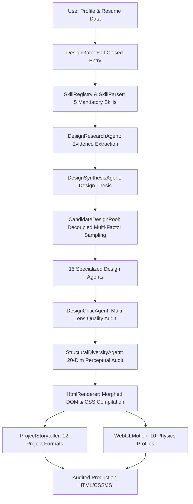

# 🏛️ Compositional Generative Design Engine Architecture

## 1. System Overview

The Compositional Generative Design Engine is an autonomous, deterministic, and fail-closed design intelligence platform that transforms raw user profile data into bespoke, accessible, mobile-first portfolio websites.

The engine does NOT use fixed templates, hardcoded card grids, or paid AI APIs. Instead, it relies on a layered architecture of 15 specialized design modules, active open-source design skills, dynamic candidate design pools, and perceptual memory fingerprinting.

---

## 2. Core Architectural Layers

---

## 3. Decoupled Dimension Matrix

The engine decouples structural and visual dimensions to eliminate template convergence:

| Dimension | Candidates | Engine / Module | Role |
|---|---|---|---|
| **Information Architecture** | 10 Models | `src/design-engine/ia-composer.js` | Narrative sequencing, content hierarchy, and viewport structure. |
| **Spatial Layout Grammar** | 10 Grammars | `src/design-engine/layout-grammar.js` | CSS Grid/Flex spatial coordinate geometry. |
| **Project Storytelling** | 12 Formats | `src/design-engine/project-storyteller.js` | Bespoke DOM presentation for case studies and artifacts. |
| **Visual Universe** | 10 Universes | `src/design-engine/visual-grammar.js` | Creative direction, border radii, shadows, and surfaces. |
| **Typography Systems** | 10 Systems | `src/design-engine/typography-systems.js` | Display/body pairings, scale ratios ($1.25$ to $1.414$), tracking. |
| **Color Systems** | 10 Palettes | `src/design-engine/color-palettes.js` | WCAG AAA compliant palettes with $> 7:1$ contrast. |
| **Motion Languages** | 10 Profiles | `src/design-engine/motion-profiles.js` | GSAP 3.12+ easing curves, transforms, and reduced-motion fallback. |
| **Hero Archetypes** | 8 Archetypes | `src/design-engine/html-renderer.js` | Asymmetric, split, terminal, monumental, runway, monograph leads. |
| **Section Morphing** | 10 Adaptations | `src/design-engine/html-renderer.js` | Credentials adapted to active visual grammar. |

---

## 4. Multi-Factor Candidate Scoring

$$\text{CandidateScore} = 0.25 \times \text{ContentFit} + 0.20 \times \text{DesignQuality} + 0.25 \times \text{DiversityScore} + 0.15 \times \text{SkillInfluence} + 0.15 \times \text{AccessibilityScore}$$

---

## 5. Security & Fail-Closed Gate Guarantees

- **No Paid APIs**: Operates entirely with local deterministic computation and open-source skills.
- **Fail-Closed Gate**: Any missing skill file, corrupted schema, or perceptual duplicate halts generation.
- **Production Bypass Protection**: Direct calls to renderer without a validated `DesignBrief` are blocked.
- **Full Security Suite Preserved**: HMAC webhook verification, CSRF tokens, SSRF protection, path traversal defenses, rate limiting, and session security remain active and fully tested.
