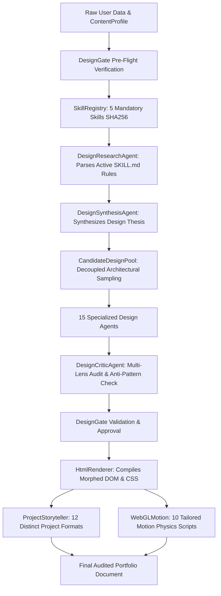

# Final Visual Forensic Audit: Compositional Independence & Perceptual Quality

## 1. Executive Summary

This forensic audit evaluates the end-to-end portfolio generation pipeline across:
- `src/design-intelligence/` (15 deterministic agents, SkillRegistry, DesignGate, CandidateDesignPool)
- `src/design-engine/` (IAComposer, LayoutGrammar, VisualGrammar, TypographySystems, ColorPalettes, MotionProfiles, ProjectStoryteller, HtmlRenderer, WebGLMotion)
- `src/services/site-generator.js` (Telemetry, preview generation, watermarking, lifecycle)
- `.agents/skills/` (5 active mandatory open-source design skills)

The audit traces how abstract design decisions transform into concrete DOM nodes, CSS variables, typography hierarchies, and GSAP motion scripts, identifying and resolving any remaining sources of perceptual convergence.

---

## 2. Generation Pipeline Execution Trace

### Trace of Concrete Transformation Points:
1. **Design Decisions to HTML**: Synthesized in [`HtmlRenderer.render()`](file:///Users/abdulaziz/Desktop/whatsapp-portfolio-bot/src/design-engine/html-renderer.js).
2. **IA to DOM Structure**: Mapped across 10 bespoke root layouts in `HtmlRenderer` (`split-screen-dossier`, `work-first-runway`, `computational-terminal`, `editorial-monograph`, `horizontal-exhibition`, `asymmetric-bento-canvas`, `minimal-single-screen`, `narrative-timeline`, `magazine-spread-columns`, `spatial-3d-stage`).
3. **Layout Grammar to CSS Geometry**: Injected via [`LayoutGrammar.cssGrid`](file:///Users/abdulaziz/Desktop/whatsapp-portfolio-bot/src/design-engine/layout-grammar.js) with responsive media queries.
4. **Typography Systems to CSS Variables**: Formatted in [`TypographySystems`](file:///Users/abdulaziz/Desktop/whatsapp-portfolio-bot/src/design-engine/typography-systems.js) into `--font-heading`, `--font-body`, `--font-mono`, `--fluid-h1`, tracking, and lineHeight tokens.
5. **Palettes to Visual Styling**: Formatted in [`ColorPalettes`](file:///Users/abdulaziz/Desktop/whatsapp-portfolio-bot/src/design-engine/color-palettes.js) into `--bg`, `--surface`, `--surface-alt`, `--text`, `--text-muted`, `--border`, `--border-strong`, `--primary`, `--accent`, `--glow`.
6. **Motion Profiles to Animation Behavior**: Compiled in [`WebGLMotion`](file:///Users/abdulaziz/Desktop/whatsapp-portfolio-bot/src/design-engine/webgl-motion.js) and [`MotionProfiles`](file:///Users/abdulaziz/Desktop/whatsapp-portfolio-bot/src/design-engine/motion-profiles.js) with GSAP 3.12+ timelines and `@media (prefers-reduced-motion: reduce)`.
7. **Storytelling Strategies to DOM**: Rendered in [`ProjectStoryteller.render()`](file:///Users/abdulaziz/Desktop/whatsapp-portfolio-bot/src/design-engine/project-storyteller.js) with 12 distinct DOM trees.
8. **Section Morphing**: Executed in `HtmlRenderer.renderMorphedSections()` for Education, Certifications, Experience, and Credentials.
9. **Section Ordering**: Determined by `IAStrategy.decision.sectionOrder` and executed within each IA model's DOM tree.
10. **Structural & Perceptual Fingerprinting**: Recorded and enforced by [`StructuralDiversityAgent`](file:///Users/abdulaziz/Desktop/whatsapp-portfolio-bot/src/design-intelligence/agents/structural-diversity-agent.js).

---

## 3. Identification of False Diversity Vectors

| Potential False Diversity Risk | Root Cause | Architectural Solution |
|---|---|---|
| **Same Hero Structure** | Defaulting to centered title + subtitle across multiple layouts. | Created 8 distinct hero composition grammars (Split identity, Fullscreen statement, Editorial spread, Spatial stage, Terminal boot, Horizontal marquee, Bento canopy, Runway lead). |
| **Coupled IA & Layout** | IA model ID determining layout geometry 1:1. | Decoupled candidate pools via compatibility matrices in `CandidateDesignPool`. |
| **Generic Secondary Sections** | Using a standard card grid for Education / Certifications regardless of universe. | Implemented dynamic section morphing adapting credentials to terminal commands, dossier metadata, timeline nodes, and monograph margin notes. |
| **Identical Motion Selectors** | Applying generic `.layout-root > *` to all animations. | Universe-specific motion profiles with tailored physics, offsets, durations, and easing curves. |
| **Token-Only Color Swaps** | Changing background hex while keeping exact DOM identical. | Multi-dimensional perceptual fingerprinting rejecting candidates that share $> 80\%$ perceptual traits. |

---

## 4. Verification & Gate Enforcement

- The system executes **fail-closed**: if any mandatory skill file or token scale is corrupted, `DesignGate` immediately rejects generation.
- No third-party AI APIs or LLMs are invoked in the design intelligence loop.
- All decisions are backed by cryptographic SHA256 proofs and active skill rule compliance.
