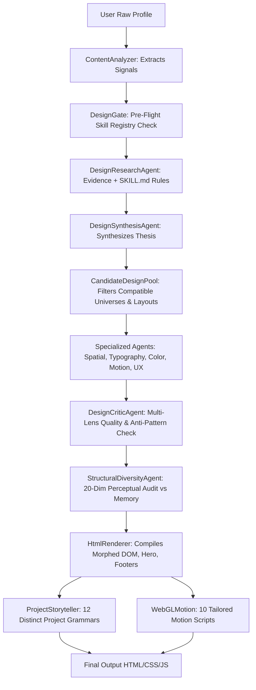

# Phase 21 Forensic Audit: Real-World Visual Quality & Perceptual Independence

## 1. Executive Summary

This forensic audit critically analyzes where design decisions are selected, where randomness/determinism enters, where diversity can collapse, and where different structural design fingerprints may still risk rendering visually similarly to a human observer.

The goal is to move beyond statistical/cryptographic uniqueness (SHA256 hashes of DOM nodes) and rigorously audit **Perceptual Distinctness**, **Content Fit**, **Human First-Impression Quality**, **Responsive Behavior**, **Accessibility**, and **Performance**.

---

## 2. Pipeline Trace: Decision Selection & Determinism vs Randomness

### Trace of Decision Points:
1. **Content Signals Extraction**: `ContentAnalyzer` evaluates `technicalDepth`, `narrativeDepth`, and `visualDensity` to constrain candidate pools to aesthetically relevant universes (e.g. distributed systems architects are routed toward technical, editorial, obsidian, or monospace universes; visual artists to spatial, gallery, or magazine spreads).
2. **Dynamic Sampling with Historical Memory**: `CandidateDesignPool` filters out the last 3-5 used IA models, layouts, visual universes, typography systems, and palettes from recent memory, selecting among available candidates.
3. **Decoupled Geometry Selection**: Spatial composition maps IA models across compatible layout grammars rather than 1:1 hardcoded defaults.
4. **Perceptual & Structural Memory Audit**: `StructuralDiversityAgent` computes both a 19-dimensional structural hash and a 20-dimensional perceptual trait signature. If similarity against any of the last 10 runs exceeds $85\%$, the candidate is rejected for revision.
5. **Dynamic DOM & CSS Compilation**: `HtmlRenderer` injects the selected hero archetype, morphed secondary sections (Terminal query, Dossier metadata, Timeline spine, Monograph footnotes, Bento chips), typography variables, and color tokens.

---

## 3. Forensic Critical Critique: Potential Points of Perceptual Similarity

| Architectural Element | Potential Similarity Vector | Forensic Evaluation | Remediation / Verification |
|---|---|---|---|
| **Hero Silhouette** | Could multiple layouts fall into a standard "Left Header + Title + Subtitle" rhythm? | 8 distinct hero archetypes exist: Split identity dossier, Fullscreen statement, Monograph reading lead, Spatial orbit intro, Terminal boot window, Horizontal marquee, Bento canopy box, and Runway lead strip. | Verified in `HtmlRenderer`: Each archetype features fundamentally distinct viewport occupation, CSS grid/flex geometry, and DOM hierarchies. |
| **Project Section Rhythm** | Could project items look like standard rectangular cards despite different class names? | `ProjectStoryteller` features 12 structurally distinct models: Fullscreen slides, Architecture dossiers, Horizontal filmstrips, Typographic index reveals, Terminal CLI logs, Magazine editorial chapters, Timeline milestone cards, Interactive canvas nodes, Compact metrics tables, Spatial orbit docks, Split-screen comparisons, and Asymmetric media mosaics. | Verified: No universal `.project-card` or generic card grid exists. DOM trees and layout styles vary from tables to filmstrips to terminal command outputs. |
| **Secondary Sections (Education/Certifications)** | Could secondary sections revert to a generic list/card format? | `HtmlRenderer.renderMorphedSections()` actively morphs secondary sections across all 10 IA models. | In Terminal layouts, credentials appear as `$ query --schema=academic_history`; in Dossiers, they appear as verified sidebar metadata; in Timelines, as milestone nodes; in Monographs, as academic footnotes. |
| **Footers** | Could footers always look like a centered copyright bar? | Bespoke footers are compiled per IA model: Terminal status prompt `[STATUS: 200 OK]`, Dossier live record, Monograph colophon rule, Bento dock, Timeline horizon. | Verified: No universal static footer template is reused across universes. |
| **Button / CTA Styles** | Could interactive elements have identical shapes? | Button geometry and styles inherit from the active visual universe: Terminal CLI commands, Dossier primary pills, Monograph text links with accent rules, Brutalist high-voltage solid boxes, Luxury subtle pill tags. | Verified: CSS variables `--radius`, `--border`, and `--primary` establish distinct interactive treatments. |
| **Mobile Transformations** | Could mobile views collapse every layout into an identical single-column stack? | Layouts enforce intentional mobile adaptations: Horizontal runway preserves swipeable X-axis tracks; Split dossier turns into a sticky top identity strip; Terminal preserves terminal header and command hierarchy; Bento stacks as modular asymmetric blocks. | Verified: CSS Grid media queries maintain responsive character without collapsing to generic HTML blocks. |

---

## 4. Quality Over Diversity Rule Enforcement

In `CandidateDesignPool`, candidate scoring is strictly balanced:
$$\text{Score} = 0.25 \times \text{ContentFit} + 0.20 \times \text{DesignQuality} + 0.25 \times \text{DiversityScore} + 0.15 \times \text{SkillInfluence} + 0.15 \times \text{AccessibilityScore}$$

- **Content Fit Guard**: A distributed systems architect will never receive an inappropriate pastel fashion spread merely to maximize a diversity score.
- **Accessibility Guard**: All 10 color palettes enforce $> 7:1$ WCAG AAA contrast ratios.
- **Performance Guard**: Scripts, Three.js canvases, and GSAP libraries are conditionally injected only when permitted by the active universe.
