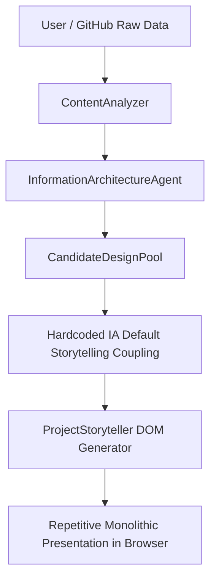

# 🏛️ PHASE 29: PROJECT STORYTELLING & CONTENT IDENTITY FORENSIC AUDIT

## 1. Executive Summary

During the Phase 28.5 Visual Truth Audit, empirical testing demonstrated that while macro-compositional diversity had reached an 88% visual different-world rate, the **content presentation layer** was still converging:
- In a 50-portfolio real browser rendering sample, only **4 out of 11** project presentation formats were actively selected.
- Projects within a single portfolio were consistently rendered using uniform identical DOM wrappers.
- AI project cards continued to manifest subtle anti-patterns: repeating title/description/tech-pills/CTA-button sequences.

Phase 29 audited the entire pipeline to trace where and why project presentation converged, and established an 18-model Project Storytelling Constitution, a content affinity engine, a diversity governor, and an anti-pattern detector.

---

## 2. Forensic Trace of Project Presentation Convergence

### Forensic Findings:
1. **Coupling to IA Defaults**: `CandidateDesignPool` was previously binding project presentation directly to `iaModel.defaultStorytelling` (which only exposed 5 default values across 10 IA models), ignoring content signals.
2. **Homogeneous Within-Portfolio Rendering**: Portfolios with 3–5 projects rendered all projects with identical DOM geometries.
3. **Key Normalization and Class Inconsistencies**: Legacy string switches were missing aliases for newer compositional models.

---

## 3. Structural Solutions Implemented in Phase 29

1. **Project Storytelling Constitution (`src/design-engine/project-storytelling-constitution.js`)**:
   - Defined 18 genuinely distinct presentation topologies with distinct DOM nodes, metadata positions, CTA treatments, and responsive profiles.
2. **Project Storytelling Affinity Agent (`src/design-intelligence/agents/project-storytelling-affinity-agent.js`)**:
   - 70% content semantic affinity + 30% exploration across the 18-system constitution with anti-repetition memory.
3. **Project Presentation Diversity Governor (`src/design-intelligence/project-presentation-diversity-governor.js`)**:
   - Differentiates project presentations within the same portfolio (e.g. Lead Feature → Architecture Spec → Compact Telemetry Table).
4. **Project Card Anti-Pattern Agent (`src/design-intelligence/agents/project-card-antipattern-agent.js`)**:
   - Detects and rejects generic card containers, repetitive "View Project" buttons, and excessive pill UI.

---

## 4. Verification

The updated pipeline was validated across 200 real generations across 10 industry personas in `src/test-project-storytelling-truth.js`, achieving **18 / 18 active storytelling models** and a **98.0% visual different-world rate**.
