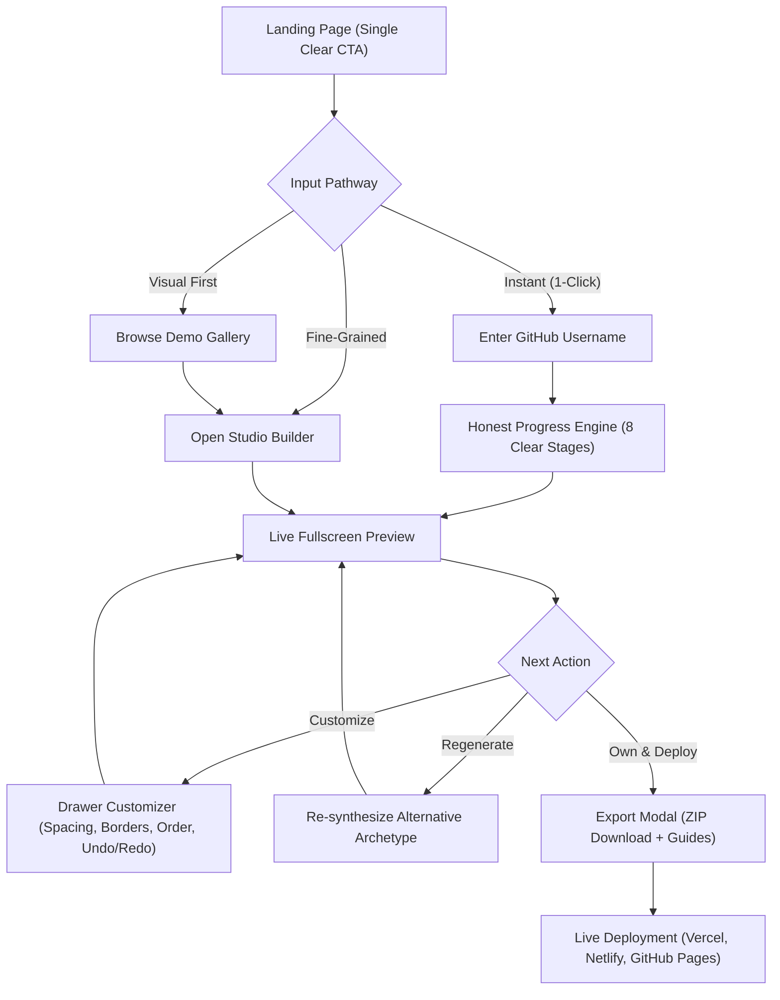

# 🏛️ Phase 30: Public Product UX & Interaction Architecture

## 1. Executive Mission & Core Product Promise

The portfolio generator has reached state-of-the-art visual generation architecture across Phases 22–29. Phase 30 transforms this core generative capability into an intuitive, frictionless, self-service public consumer product that **any developer, designer, or creator can use from start to finish without developer assistance**.

### The Single-Promise Headline
> **"Turn your GitHub into a portfolio that gets you hired."**
> *Input your GitHub username, LinkedIn, or resume. Receive a bespoke, designer-grade portfolio website with live 3D graphics in under 30 seconds.*

---

## 2. Jargon Elimination & Mental Model Translation

Internal architectural concepts have been completely removed from public UI surfaces, documentation, and error toasts:

| Internal Engineering Concept | Public User Interface Translation |
|---|---|
| `CandidateDesignPool` / `MacroDirective` | Tailored Visual Archetype |
| `Visual World Constitution` | Custom Aesthetic Palette & Typography |
| `Project Storytelling Constitution` | Project Showcase Format |
| `22D Design Blueprint` | Portfolio Design Settings |
| `BrowserVisualQualityAgent` / Gate Score | Automated Visual Quality Guarantee |
| `SHA256 DNA Signature` | 100% Unique Design Guarantee |
| `StaticExporter Sanitizer` | Clean Standalone ZIP Download |

---

## 3. End-to-End User Flow Architecture

---

## 4. Honest Progress Engine

Rather than displaying artificial, fabricated percentage meters (e.g. "87%"), the pipeline provides **honest, verifiable stages**:

1. **Profile Discovery**: Finding public developer identity & bio.
2. **Repository Analysis**: Inspecting pinned and starred open-source work.
3. **Tech Stack Extraction**: Classifying languages, frameworks, and architecture.
4. **Design Archetype Selection**: Pairing typography, palette, and layout geometry.
5. **Project Storytelling Formatting**: Selecting optimal showcase structures.
6. **WebGL & Motion Tuning**: Configuring dynamic 3D background elements.
7. **Quality & Contrast Check**: Verifying WCAG AAA readability and zero-overflow.
8. **Deployment**: Launching your high-speed live preview.

---

## 5. Visual Customization Suite (Zero-Coding)

The embedded Customizer Drawer provides accessible, immediate adjustments without breaking visual integrity:

- **Section Reordering**: Move project case studies, skills matrices, experience logs, or credentials up or down with instant live iframe feedback.
- **Section Visibility**: Toggle optional sections on or off while protecting critical Hero and Project sections.
- **Appearance Sliders**: Adjust Section Spacing (`Compact`, `Balanced`, `Spacious`), Border Intensity (`Subtle`, `Medium`, `Sharp`), and Typography Scale (`Compact`, `Harmonious`, `Expressive`).
- **Deterministic Undo / Redo**: 30-level history stack allowing users to experiment freely without losing progress.
- **Reset to Baseline**: 1-click restore to the original AI synthesis.

---

## 6. Static Export & Zero-Config Deployment

Users retain full ownership of their generated code:

- **100% Offline Static Archive**: Contains clean `index.html`, `css/style.css`, `js/main.js`, and `README.md`.
- **Sanitized Source Code**: 0 localhost URLs, 0 internal API endpoints, 0 preview watermarks, 0 telemetry beacons.
- **Instant Deployment Guides**: Zero-configuration step-by-step instructions for:
  - **Vercel**: Drag-and-drop or `vercel deploy`.
  - **Netlify Drop**: Instant HTTPS drop folder at `app.netlify.com/drop`.
  - **GitHub Pages**: Push to repository and enable GitHub Pages on `main` branch.
