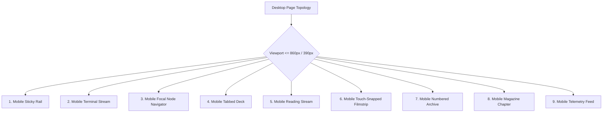

# 🏛️ Phase 35: Responsive Composition & Mobile Transformation Architecture

## 1. The Mobile Anti-Convergence Challenge

Most web generators handle mobile responsiveness by collapsing multi-column desktop grids into a single 390px vertical column of identical cards (`grid-template-columns: 1fr`). On mobile, every portfolio ends up looking like a generic clone.

Phase 35 eliminates this regression by introducing **9 distinct mobile transformation archetypes**, each with custom touch ergonomics, scroll kinetics, and layout topology.

---

## 2. Nine Mobile Transformation Archetypes



### 2.1 Detailed Archetype Specifications

| Mobile Transformation | Target Desktop Topology | Mobile DOM & CSS Architecture | Touch Ergonomics |
|---|---|---|---|
| **1. Mobile Sticky Rail** | Asymmetric Split Canvas, Vertical Identity Rail | Converts fixed lateral desktop rail into a compact top identity bar with collapsible capabilities drawer and full-width content stream. | Header sticky with 44px touch targets. |
| **2. Mobile Terminal Stream** | Command Console Interface | Dense multi-column console reflows into a single continuous monospace CLI stream with touch-to-execute prompt tabs. | Fast kinetic scroll with monospace CLI prompt chips. |
| **3. Mobile Focal Node Navigator** | Full Viewport Stage, Floating Spatial 3D Stage | 3D spatial stage switches to a centered focal node carousel with swipeable chapter pagination and floating bottom pill dock. | Horizontal swipe gesture with haptic-styled pagination. |
| **4. Mobile Tabbed Deck** | Offset Poster Canvas, Bento Grid Canvas | Multi-span asymmetric bento tiles convert into a vertical index deck with sticky section anchors. | Segmented touch controls at top of viewport. |
| **5. Mobile Reading Stream** | Narrow Reading Column, Editorial Monograph | Optimizes 860px monograph for 390px portrait reading with 1.65 line-height and generous margins. | Smooth vertical typography runway. |
| **6. Mobile Touch-Snapped Filmstrip** | Image-Led Gallery, Horizontal Exhibition | Horizontal track enables native CSS `scroll-snap-type: x mandatory` with touch-friction physics. | Kinetic finger swiping with visual peek on right border. |
| **7. Mobile Numbered Archive** | Archive Index Matrix | Table rows convert to compact indexed cards with prominent index badges `[01]`, `[02]`. | Tap to expand deep technical spec. |
| **8. Mobile Magazine Chapter** | Magazine Spread, Newspaper Column Grid | 3-column asymmetric layout stacks into consecutive editorial chapters with pull-quote dividers. | Reading rhythm with oversized lead drop-caps. |
| **9. Mobile Telemetry Feed** | Data Observatory, Architectural Plate | Multi-metric telemetry panels re-align into a structured 2-column KPI grid followed by full-bleed case notes. | High information density without horizontal overflow. |

---

## 3. Four Canonical Testing Viewports

Every generated portfolio is evaluated across 4 physical screen geometries:

1. **Desktop Standard (1440 × 900 px)**: Full asymmetric split, multi-column bento, lateral navigation rails.
2. **Laptop / Small Desktop (1024 × 768 px)**: Proportional fluid scaling with CSS `clamp()`, reduced gutter widths.
3. **Tablet Portrait (768 × 1024 px)**: Unified reading column transformation, responsive navigation docking.
4. **Mobile Smartphone (390 × 844 px)**: Archetype-specific transformation model with zero horizontal overflow (`overflow-x: hidden`).

---

## 4. Live Responsive Injection Code

`CompositionPlan` injects live responsive CSS directly into the compiled `<style>` block:

```css
/* Live Authoritative Mobile Responsive Transformation */
@media (max-width: 860px) {
  .layout-asymmetric-split { grid-template-columns: 1fr !important; }
  .split-identity-col { position: static !important; height: auto !important; border-right: none !important; border-bottom: 1px solid var(--border) !important; padding: 2rem 1.25rem !important; }
  .split-content-stream { padding: 2rem 1.25rem !important; }
  .bottom-chapter-nav { bottom: 12px !important; width: 92vw !important; padding: 10px 16px !important; font-size: 0.8rem !important; }
}
```
