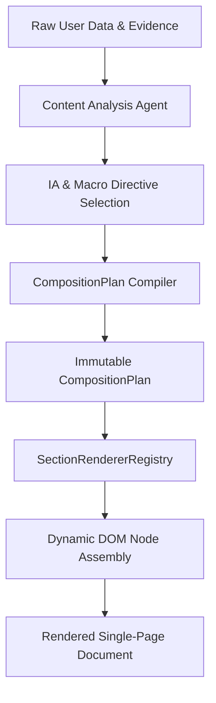

# 🏛️ Phase 35: Section Order & Layout Architecture

## 1. Executive Summary

Phase 35 establishes **CompositionPlan** as the single authoritative runtime composition contract in the Portfolio Studio engine. Previous generations suffered from hardcoded template branching where Information Architecture (IA) models directly dictated HTML structure via `if (iaModel.id === '...')` conditions in the renderer.

In Phase 35:
1. **IA Chooses Intent**: IA agents and Macro Design Directives specify structural ordering, hierarchy weights, and content priorities based on verified user content signals.
2. **CompositionPlanner Compiles Intent**: `CompositionPlan.buildPlan` compiles this intent into an immutable, mathematically validated `CompositionPlan` specifying:
   - `pageTopology` (container dimensions, grid rules, split physics)
   - `openingTopology` (hero / viewport opening semantics)
   - `navigationGrammar` (coordinate system & DOM structure)
   - `sectionGrammar` (`sequence`, `whitespaceDistribution`, `morphingRules`)
   - `projectArtifactPlan` (multi-artifact suites per project)
3. **Renderer Executes CompositionPlan Decoupled from IA**: `HtmlRenderer.render` operates as a pure execution pipeline. It traverses `compositionPlan.sectionGrammar.sequence` and invokes `SectionRendererRegistry.renderSection(key, context)` dynamically without querying or branching on IA model IDs.

---

## 2. Dynamic Section Sequencing Engine

### 2.1 The Legacy Monopoly & Failure Modes
Legacy generative websites enforce a rigid universal skeleton:
`[ Hero -> Bio/About -> Projects -> Skills -> Experience -> Contact ]`

This creates perceptual convergence: even if fonts or colors change, the user experiences the exact same repetitive vertical scrolling layout.

### 2.2 Phase 35 Section Sequencing Pipeline



### 2.3 Distinct Generative Section Sequences Active in Production

| Sequence ID | Sequence Flow | Target Persona / Intent |
|---|---|---|
| **Seq 01: Work Runway** | `work_runway -> technical_evidence -> professional_journey -> creator_statement -> contact_dock` | Systems Architects, High-Output Engineers |
| **Seq 02: Split Dossier** | `split_identity -> featured_artifacts -> verified_stack -> experience_record -> direct_contact` | Full-Stack Engineers, Tech Leads |
| **Seq 03: Horizontal Track** | `exhibition_title -> curated_track -> skills_archive -> experience_index -> contact_gate` | Creative Developers, 3D Artists, Visual Designers |
| **Seq 04: Editorial Essay** | `monograph_cover -> thesis_statement -> project_chapters -> trajectory_essay -> sign_off` | Academic Researchers, AI Scientists |
| **Seq 05: Computational CLI** | `cli_prompt_hero -> system_capabilities -> executed_projects -> kernel_history -> connect_terminal` | Security Architects, Low-Level Kernel Devs |
| **Seq 06: Spatial Orbit** | `stage_intro -> orbiting_projects -> stack_constellation -> career_trajectory -> beacon_contact` | WebGL / Spatial Computing Developers |
| **Seq 07: Chronological Spine** | `prologue_hero -> chronological_milestones -> mastered_tools -> epilogue_contact` | Executive Leaders, Founding Engineers |
| **Seq 08: Magazine Spread** | `magazine_header -> three_column_portfolio -> editorial_skills -> author_profile -> contact_spread` | Design Engineers, Creative Directors |

---

## 3. SectionRendererRegistry Architecture

`SectionRendererRegistry` normalizes arbitrary section keys into canonical renderers, ensuring fail-closed safety while preserving custom intent.

```javascript
class SectionRendererRegistry {
  static normalizeSectionKey(key = '') {
    const k = String(key).toLowerCase().replace(/[^a-z0-9_]/g, '_');
    
    if (k.includes('project') || k.includes('artifact') || k.includes('work') || k.includes('mosaic') || k.includes('track') || k.includes('portfolio') || k.includes('curated_work') || k.includes('specimen') || (k.includes('index') && !k.includes('archive') && !k.includes('nav'))) {
      return 'PROJECTS';
    }
    if (k.includes('hero') || k.includes('opening') || k.includes('identity') || k.includes('cover') || k.includes('boot') || k.includes('masthead') || k.includes('opener') || k.includes('intro') || k.includes('title')) {
      return 'HERO';
    }
    if (k.includes('experience') || k.includes('timeline') || k.includes('career') || k.includes('chronicle') || k.includes('trajectory') || k.includes('milestone') || k.includes('journey') || k.includes('dossier') || k.includes('history') || k.includes('profile') || k.includes('author')) {
      return 'EXPERIENCE';
    }
    if (k.includes('skill') || k.includes('capability') || k.includes('stack') || k.includes('evidence') || k.includes('inventory') || k.includes('tool') || k.includes('diagnostic') || k.includes('spec') || k.includes('matrix')) {
      return 'SKILLS';
    }
    if (k.includes('thesis') || k.includes('manifesto') || k.includes('telemetry') || k.includes('statement') || k.includes('metric') || k.includes('publication') || k.includes('horizon')) {
      return 'THESIS';
    }
    if (k.includes('education') || k.includes('academic') || k.includes('citation') || k.includes('credential')) {
      return 'EDUCATION';
    }
    if (k.includes('cert') || k.includes('award') || k.includes('honor') || k.includes('badge')) {
      return 'CERTIFICATIONS';
    }
    if (k.includes('contact') || k.includes('footer') || k.includes('colophon') || k.includes('status') || k.includes('inquiry') || k.includes('connect') || k.includes('credit') || k.includes('dock') || k.includes('reach') || k.includes('epilogue') || k.includes('exit') || k.includes('sign_off') || k.includes('beacon') || (k.includes('spread') && k.includes('contact'))) {
      return 'CONTACT';
    }
    return 'GENERIC';
  }
}
```

---

## 4. Resume Retention & Semantic Safety Guarantee

To guarantee that user resume data is never dropped if an experimental IA sequence omits secondary sections:
1. **Primary H1 Guarantee**: If `sequence` omits `hero` or `thesis`, `HtmlRenderer` prepends a semantic opening `hero` block ensuring WCAG level AA structural hierarchy.
2. **Missing Section Append Protocol**: If `projects`, `experience`, `skills`, `education`, or `certifications` are present in `contentProfile` but absent from `sequence`, `HtmlRenderer` dynamically renders and embeds them before the final contact dock.
3. **Zero Template Coupling**: The renderer makes zero queries to `iaModel.id`.
