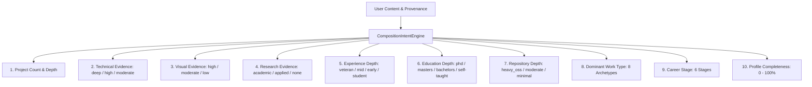

# 🏛️ Phase 37: Composition Intent Architecture

## 1. Overview

The **Composition Intent Architecture** bridges raw user evidence (GitHub repositories, resume PDFs, visual uploads, guided questions) to tailored structural compositions. Rather than treating all users identically or randomly assigning layouts, `CompositionIntentEngine` derives 14 deep semantic evidence dimensions and maps them directly to information architecture, page topology, and within-portfolio artifact presentations.

---

## 2. 14 Semantic Evidence Dimensions

### 2.1 Dominant Work Types & Structural Mappings

| Dominant Work Type | Evidence Tokens & Criteria | Target Page Topologies | Target Opening Topology | Recommended Section Ordering |
|---|---|---|---|---|
| **`systems_kernel`** | Rust, C++, Linux eBPF, Raft, RocksDB, low-level concurrency. | `command-console-interface`, `vertical-identity-rail`, `asymmetric-split-canvas` | `terminal-boot-sequence` | `cli_prompt_hero -> system_capabilities -> executed_projects -> kernel_history -> connect_terminal` |
| **`ai_ml_research`** | PyTorch, CUDA, arXiv citations, Transformer attention kernels. | `narrow-reading-column`, `newspaper-column-grid`, `data-observatory` | `research-abstract-monograph` | `monograph_cover -> thesis_statement -> project_chapters -> trajectory_essay -> sign_off` |
| **`creative_visual`** | Three.js, WebGL, GLSL shaders, Blender, 3D spatial UI. | `image-led-gallery`, `floating-spatial-composition`, `full-viewport-stage` | `full-viewport-stage` | `stage_intro -> orbiting_projects -> stack_constellation -> career_trajectory -> beacon_contact` |
| **`design_systems`** | Figma, WCAG tokens, typography scales, design components. | `magazine-spread`, `asymmetric-split-canvas`, `offset-poster-canvas` | `newspaper-front-page` | `magazine_header -> three_column_portfolio -> editorial_skills -> author_profile -> contact_spread` |
| **`devops_cloud`** | Kubernetes, Terraform, ArgoCD, Prometheus telemetry. | `command-console-interface`, `architectural-plate`, `asymmetric-split-canvas` | `terminal-boot-sequence` | `cli_prompt_hero -> system_capabilities -> executed_projects -> kernel_history -> connect_terminal` |
| **`student` / `junior_dev`** | Academic degree candidate, coursework, compact experience. | `offset-poster-canvas`, `asymmetric-split-canvas`, `edge-to-edge-editorial` | `editorial-thesis` | `prologue_hero -> mastered_tools -> featured_artifacts -> academic_record -> epilogue_contact` |

---

## 3. Synthesis Flow

1. `CompositionIntentEngine.deriveIntent(profile)` extracts 14 evidence dimensions.
2. `CompositionIntentEngine.recommendCompositionGrammar(intent)` suggests compatible topologies, section sequences, and hero geometries.
3. `CompositionPlan.buildPlan` compiles the intent into an immutable `CompositionPlan` contract.
