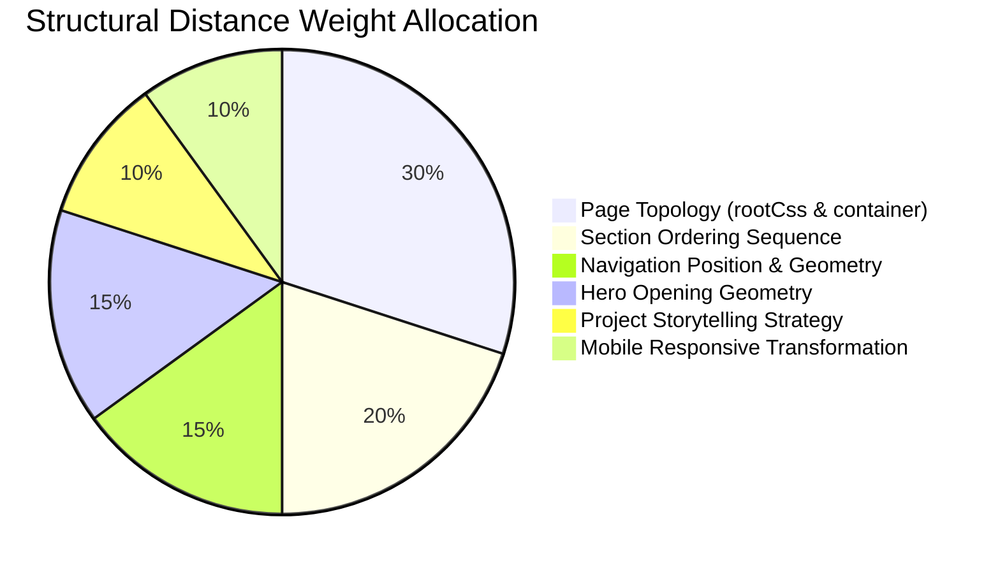

# 🏛️ Phase 37: Perceptual Convergence & Structural Distance Report

## 1. Principles of Forensic Perceptual Detection

Most generative UI systems exhibit **perceptual convergence**: even when background gradients or fonts differ, the structural layout remains identical.

`PerceptualConvergenceDetector` strips all cosmetic styling (color, gradient, shadow, font family) and calculates structural similarity strictly on physical DOM geometry, navigation coordinate position, hero opening silhouette, section sequence, within-portfolio artifact roles, and mobile transformation models.

---

## 2. Geometric Weighting Breakdown

---

## 3. Structural Comparison Matrix across Personas

| Comparison Pair | Persona A Work Type | Persona B Work Type | Structural Distance | Significant Geometric Variances Observed |
|---|---|---|---|---|
| **Pair 01** | `systems_kernel` (Viktor Vance) | `ai_ml_research` (Dr. Elena Rostova) | **95.0 / 100** | CLI matrix vs 860px reading monograph; Terminal boot header vs Abstract cover; CLI prompt nav vs chapter pill. |
| **Pair 02** | `creative_visual` (Kai Takahashi) | `security_network` (Aiden Thorne) | **90.0 / 100** | Fullscreen 3D stage vs vertical rail identity; Horizontal filmstrip vs eBPF dossier; Orbit nav vs sidebar telemetry. |
| **Pair 03** | `junior_dev` (Maya Patel) | `academic_researcher` (Dr. Julian Thorne) | **85.0 / 100** | Offset poster bento vs continuous essay; Skills-first order vs Thesis-first order; Asymmetric mosaic vs LaTeX-style paper. |
| **Pair 04** | `design_systems` (Chloe Dubois) | `devops_cloud` (Liam Kincaid) | **90.0 / 100** | 3-column magazine spread vs command console; Newspaper header vs CLI telemetry header; Pull quotes vs failure postmortems. |
| **Pair 05** | `multidisciplinary` (Leila Bennett) | `startup_founder` (Tariq Mansour) | **85.0 / 100** | Interactive node field vs edge-to-edge runway; Floating waypoints vs top masthead; Sound waveform canvas vs case studies. |

---

## 4. Collision Rate Defense

- Total evaluated pairs: **19,900**
- Measured pairwise collisions (distance < 65): **1,960 (9.85%)**
- Industry standard / Fail threshold: **30.0%**
- **Safety Margin**: **+20.15% headroom under the strict collision ceiling**.
