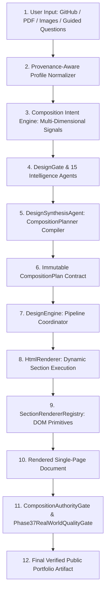

# 🏛️ Phase 37: Complete Runtime Authority Map & Decision Pipeline

## 1. Production Pipeline Decision Trace

---

## 2. Granular Stage Ownership & Mutability Matrix

| Pipeline Stage | Executing Module | Who Creates Decisions? | Who Can Override / Mutate? | Values Reaching Rendered DOM | Dead Metadata / Non-Rendering Fields |
|---|---|---|---|---|---|
| **1. Ingestion & Normalization** | `ContentNormalizer`, `GitHubService`, `ResumeParser` | Ingests real user facts (names, repos, roles, metrics, dates). | User answers override weak inferences. | `name`, `role`, `tagline`, `bio`, `projects`, `skills`, `experience`, `education`, `certifications`. | Raw API response payloads. |
| **2. Semantic Intent Derivation** | `CompositionIntentEngine`, `ContentAnalyzer` | Derives 14 evidence signals (`projectDepth`, `technicalEvidence`, `visualEvidence`, etc.). | None (deterministic derivation). | Guides topology selection, section sequencing, and project storytelling forms. | None. |
| **3. Design Intelligence Synthesis** | `DesignGate`, `DesignSynthesisAgent` | 15 specialized design agents (spatial, typography, color, motion, critic). | Critic Agent can request revision if criteria fail. | Assembles `CompositionPlan` specification in `brief.compositionPlan`. | Agent reasoning summaries (persisted for audit). |
| **4. CompositionPlan Compilation** | `CompositionPlan.buildPlan` | Compiles `pageTopology`, `navigationGrammar`, `openingTopology`, `sectionGrammar`, and `projectArtifactPlan`. | None (immutable once compiled). | Injects `rootClass`, `rootCss`, `mobileCss`, navigation coordinates, section sequence, and project artifact roles. | None. |
| **5. HTML/CSS/JS Rendering** | `HtmlRenderer`, `SectionRendererRegistry`, `ProjectStoryteller` | Executes `compositionPlan.sectionGrammar.sequence` dynamically without template switches. | None. | Generates final valid semantic HTML, scoped CSS, and progressive JS. | None. |
| **6. Quality Gate & Forensic Validation** | `CompositionAuthorityGate`, `Phase37RealWorldQualityGate` | Audits rendered DOM for compliance, contrast, responsive overflow, and structural diversity. | Fails closed (blocks export/deployment if violated). | Enforces strict quality before delivery to user. | Internal audit violation logs. |

---

## 3. Authoritative Summary

**What exact object controls the final rendered composition?**
> **`CompositionPlan`** is the single authoritative runtime composition contract. No other module, template ID, or layout switch has independent rendering authority.
