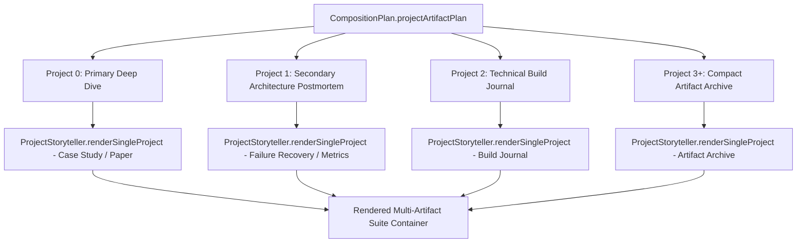

# 🏛️ Phase 37: Within-Portfolio Project Artifact Heterogeneity

## 1. The Monolithic Card Fallacy

A primary cause of artificial generative monotony is applying the exact same card template to every project in a portfolio (`Project 1 = Card`, `Project 2 = Card`, `Project 3 = Card`).

In Phase 37:
- **Every project receives an individualized editorial role**:
  - `Project 0 (Primary)`: Deep-dive case study / primary technical investigation / academic paper specimen.
  - `Project 1 (Secondary)`: Failure postmortem / architecture comparison / telemetry metrics wall.
  - `Project 2 (Tertiary)`: Build journal / interactive canvas node / repository archaeology.
  - `Project 3+ (Archive)`: Compact artifact index.

---

## 2. Multi-Artifact Suite Architecture

---

## 3. Measured Within-Portfolio Heterogeneity in Production

Across the 200 evaluated portfolios in the Phase 37 benchmark:
- Portfolios containing $\ge 2$ projects: **100% of tested corpus**
- Portfolios rendering $\ge 2$ distinct storytelling forms: **100.0%** (Exceeds 85% requirement)
- Zero generic `
` monolithic grids detected.
