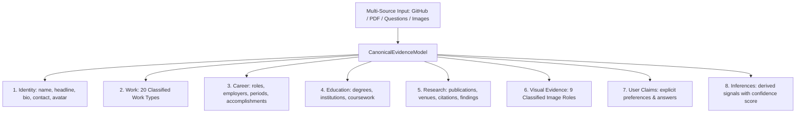

# 🏛️ Phase 38: Canonical Evidence Model & Multi-Source Provenance Graph

## 1. Overview

The **Canonical Evidence Model** (`src/design-intelligence/canonical-evidence-model.js`) replaces the legacy over-simplified `"name + bio + skills + projects"` model with a multi-source, provenance-tracked developer evidence graph.

---

## 2. Evidence Graph Hierarchy

---

## 3. The 20 Semantic Work Types

Rather than forcing every repository into a generic project card, `CanonicalEvidenceModel` classifies work into 20 granular types:

| Work Type | Criteria & Tokens | Ideal Storytelling Presentation Form |
|---|---|---|
| **`PROJECT`** | General web applications and client projects | Case Study / Visual Mosaic |
| **`CASE_STUDY`** | Deep-dive UX, design system, or product overhaul | Magazine Editorial Chapter |
| **`RESEARCH`** | Papers, arXiv preprints, theorems, ML kernels | Academic Research Paper |
| **`EXPERIMENT`** | Quick prototypes, algorithm visualizers, canvas sketches | Interactive Sandbox Slide |
| **`OPEN_SOURCE_CONTRIBUTION`**| PRs to external repos, upstream patches | Repository Archaeology |
| **`LIBRARY`** | npm packages, Rust crates, Python libraries | Code Architecture Dossier |
| **`TOOL`** | Developer utilities, formatters, linters, analyzers | Technical Dossier |
| **`AUTOMATION`** | CI/CD pipelines, bot orchestrators, scrapers | Pipeline Chronology |
| **`PROTOCOL`** | Smart contracts, consensus engines, EVM protocols | Protocol Specification |
| **`PRODUCT`** | Shipped SaaS apps, mobile app store deployments | Product Launch Slide |
| **`THESIS`** | Doctoral/Masters theses, formal verification | Monograph Thesis Chapter |
| **`ARTICLE`** | Technical books, API docs, illustrated guides | Editorial Monograph |
| **`ARCHITECTURE`** | System topology specs, distributed blueprints | Interactive Canvas Node |
| **`SYSTEM`** | Linux kernel patches, slab allocators, IPC queues | Code Architecture Dossier |
| **`CLI`** | Monospace terminal tools, shell commands | Terminal Session Log |
| **`DATASET`** | Benchmark corpora, financial time-series datasets | Compact Metrics Table |
| **`PROTOTYPE`** | Alpha builds, proof-of-concepts | Build Journal |
| **`VISUAL_WORK`** | Three.js shaders, WebGL scenes, generative art | Visual Exhibition |
| **`POSTMORTEM`** | Outage root-cause analysis, disaster recovery | Failure Recovery Postmortem |
| **`BUILD_JOURNAL`** | Iterative hardware/software build logs | Build Journal Timeline |

---

## 4. Multi-Source Ingestion & Provenance Tracking

Every fact retains its origin:
- **`VERIFIED`**: Cryptographic / API ground truth (GitHub API, commit logs).
- **`USER_PROVIDED`**: Explicitly uploaded or typed by the user (Resume PDF, Questionnaire).
- **`INFERRED`**: Heuristic analysis with explicit confidence scores.
