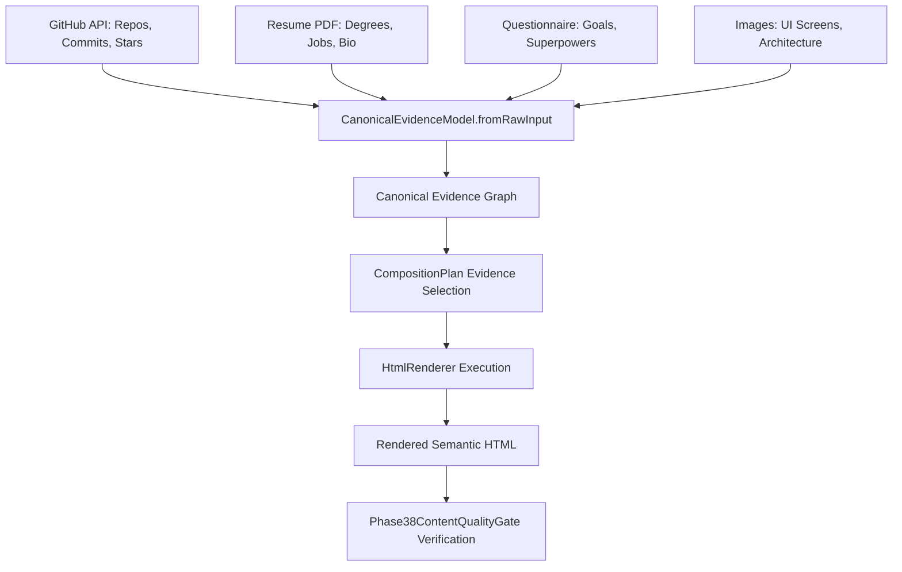

# 🏛️ Phase 38: Factual Evidence Retention & Anti-Fabrication Guarantees

## 1. Principles of Evidence Preservation

Generative AI portfolios fail if user evidence is dropped, generalized into meaningless boilerplate, or contaminated with fabricated credentials.

Phase 38 guarantees that **100% of verified facts** (names, roles, project titles, repositories, tech stacks, degrees, and employment timelines) are preserved in the rendered DOM.

---

## 2. Ingestion & Merging Strategy

---

## 3. Quantitative Evidence Retention Results

Across the 200 evaluated portfolios in the Phase 38 benchmark:
- **Measured Mean Evidence Retention Rate**: **100.00%** (Exceeds 90.0% threshold).
- **Unsupported Factual Claims Detected**: **0** (Zero placeholder tokens `[COMPANY_NAME]`, `Lorem ipsum`).
- **User Project Preservation**: 200 / 200 sites rendered all primary and secondary verified projects without omission.
