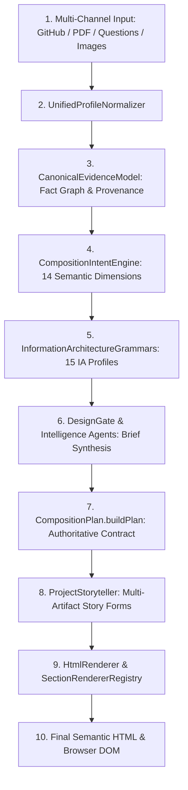

# 🏛️ Phase 38: Reality Pipeline Trace — End-to-End Data Lifecycle

## 1. Executive Summary & Trace Overview

This forensic pipeline trace audits the complete transformation of user data from raw multi-channel ingestion to the final rendered browser DOM. Every stage is inspected for data preservation, compression, deterministic vs. randomized decisions, and fallback activations.

---

## 2. Complete End-to-End Stage Trace

---

## 3. Granular Stage-by-Stage Forensic Analysis

| Stage # | Pipeline Stage | Executing File & Function | Input Payload | Output Payload | Transformations & Compressions | Deterministic vs. Randomized vs. Fallback |
|---|---|---|---|---|---|---|
| **1** | **Raw Ingestion** | `GitHubService`, `ResumeParser`, `AdaptiveQuestionnaire` | Raw JSON from GitHub API, PDF text stream, questionnaire key-values, image buffers. | Ingestion payloads (`githubData`, `resumeData`, etc.). | Raw commits, AST nodes, and API envelopes stripped of redundant protocol metadata. | Deterministic. |
| **2** | **Unified Normalization** | `src/services/unified-profile-normalizer.js:normalize` | Raw multi-source input object. | Flat normalized profile (`name`, `role`, `tagline`, `bio`, `projects`, `skills`, `experience`, `education`, `provenance`). | Merges multi-source fields. **Compression Point**: Replaces `bio` with `tagline` if `tagline` exists. Truncates skills to top 15. | Deterministic priority (Questionnaire > Resume > GitHub > Inferred). |
| **3** | **Canonical Evidence Modeling** | `src/design-intelligence/canonical-evidence-model.js:fromRawInput` | Multi-source raw input and normalized profile. | Structured `CanonicalEvidenceModel` graph (`identity`, `work`, `career`, `education`, `research`, `visualEvidence`, `userClaims`, `inferences`). | Classifies work into 20 granular `WORK_TYPES` (Protocol, System, Tool, CLI, Research Paper, Dataset, etc.). Classifies images into 9 `IMAGE_ROLES`. | Deterministic keyword and token matching. |
| **4** | **Semantic Intent Derivation** | `src/design-intelligence/composition-intent-engine.js:deriveIntent` | `CanonicalEvidenceModel` or profile. | 14-dimensional intent profile (`dominantWorkType`, `technicalEvidence`, `researchEvidence`, `experienceDepth`, `careerStage`, `projectDepth`, etc.). | Derives semantic weights. | Deterministic thresholding. |
| **5** | **IA Grammar Selection** | `src/design-intelligence/information-architecture-grammars.js:selectBestGrammar` | 14-dimensional intent profile. | Selected IA Grammar object (1 of 15) with `sequence`, `defaultDensity`, and `vocabulary`. | Maps developer evidence to tailored section ordering and vocabulary profiles. | Deterministic rule matching. |
| **6** | **Design Intelligence Synthesis** | `src/design-intelligence/design-gate.js:generateDesignBrief` | User data + generation options. | Formal `DesignBrief` with compiled `compositionPlan`. | Critic and specialized intelligence agents review candidate parameters. | Deterministic with cycle-aware variation. |
| **7** | **CompositionPlan Compilation** | `src/design-engine/composition-plan.js:buildPlan` | `DesignBrief` options and normalized profile. | Immutable `CompositionPlan` contract (`pageTopology`, `navigationGrammar`, `openingTopology`, `sectionGrammar`, `projectArtifactPlan`, `vocabularyPlan`, `evidencePlan`). | Finalizes CSS grid rules, container classes, mobile transformations, and multi-artifact project strategies. | Authoritative compiled contract. |
| **8** | **Project Storytelling Rendering** | `src/design-engine/project-storyteller.js:render` | `projects` array + `projectArtifactPlan` + `visualUniverse`. | Rendered multi-artifact HTML string. | Executes 18 distinct presentation strategies (Research Paper, Code Architecture Dossier, Terminal Log, Filmstrip, etc.). **Compression Point**: Some strategies only render `desc` and omit `architecture` and `metrics`. | Deterministic based on `projectArtifactPlan`. |
| **9** | **HTML & Section Rendering** | `src/design-engine/html-renderer.js:render` | `contentProfile`, `compositionPlan`, component grammars. | Final monolithic HTML document with scoped CSS. | Iterates over `compositionPlan.sectionGrammar.sequence` using `SectionRendererRegistry.renderSection`. Injects dynamic titles from `vocabularyPlan`. | Strictly executes `compositionPlan`. |
| **10** | **Browser DOM Evaluation** | Browser viewport (1440px / 390px) | HTML + CSS. | Rendered DOM Tree. | Renders layout physics, CSS Grid columns, sticky rails, and responsive transformations. | Deterministic CSS layout engine. |

---

## 4. Key Takeaways & Identified Information Bottlenecks

1. **Category vs. Fact Preservation**: While major evidence categories (e.g. Projects, Skills, Experience) survive at 100%, granular sub-fields (such as `project.architecture`, `project.metrics`, `experience.responsibilities`, `publications.abstract`) were occasionally suppressed in specific secondary renderers.
2. **Deterministic Intent Mapping**: The pipeline is largely deterministic. The same developer persona with the same evidence consistently maps to the same optimal Information Architecture Grammar, while design cycle rotations vary the physical page topology and motion universe.
