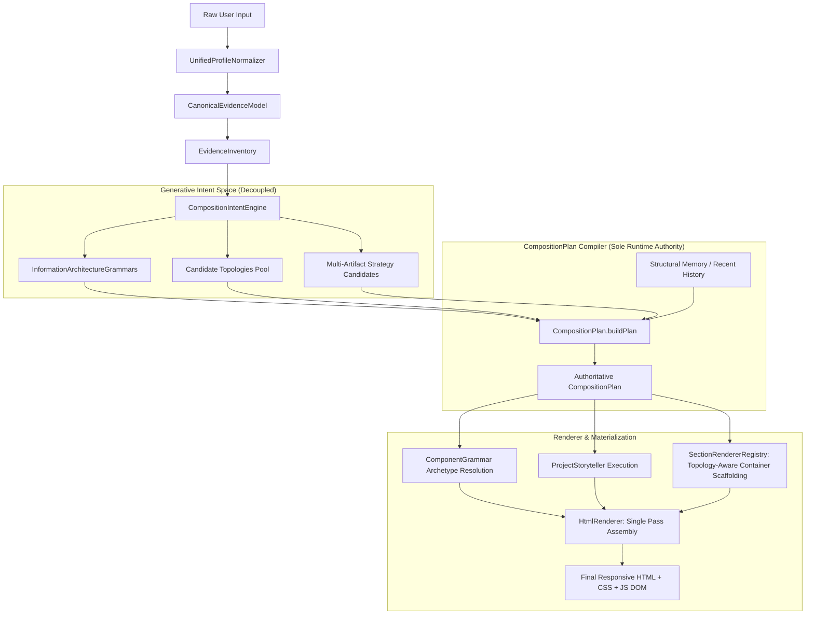

# 🏛️ Phase 40 — Decision Dependency & Runtime Data Flow Map

## Real Runtime Data Flow Architecture

---

## Decision Independence Analysis

1. **Information Architecture vs Topology**:
   - IA determines reading cadence, semantic priorities, and section ordering.
   - Topology determines physical viewport geometry (split-canvas, broadsheet, full-viewport stage, command console).
   - In Phase 40, an IA grammar is compatible with multiple distinct topologies rather than hardcoded 1:1.

2. **Project Storytelling vs Job Title**:
   - Rather than mapping "security" exclusively to a single format, the compiler samples from compatible high-fidelity representations (code-architecture-dossier, terminal-session-log, compact-metrics-table, failure-recovery-postmortem) with non-repeating anti-repetition memory.

3. **Section Scaffolding vs Global Containers**:
   - `SectionRendererRegistry` adjusts container borders, gutters, paddings, and background panels according to the active `pageTopology` rather than enforcing a universal card wrapper.
