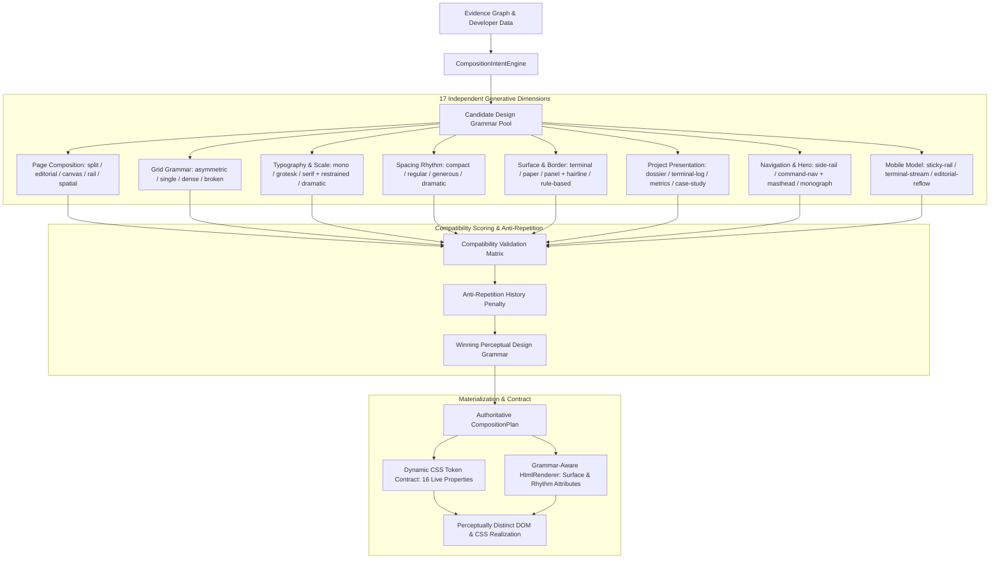

# 🏛️ Phase 41 — Decision Independence & Decoupled Generative Flow

## 1. Decoupled Generative Architecture

---

## 2. Independence Rules Enforced

1. **Evidence informs but does not deterministically lock style**:
   - Two blockchain developers or two researchers produce completely different visual layouts, navigation paradigms, and typography scales across successive generations.
2. **Topology does not force typography or spacing**:
   - An asymmetric split canvas can be styled with compact mono-technical typography or generous editorial serif typography.
3. **No Global Card Wrapper**:
   - Sections use `data-surface` and `data-border` tokens to render bespoke terminal gutters, broadsheet rules, or clean editorial margins rather than uniform card boxes.
