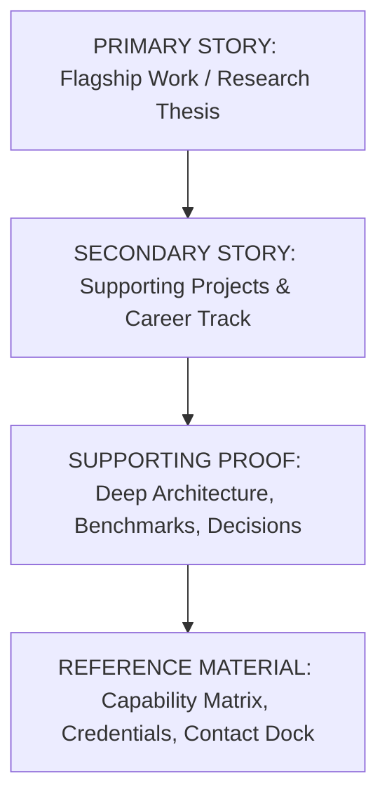

# 🏛️ Phase 42 — Content Hierarchy & Intentional Narrative Arc

## 1. The 4-Stage Narrative Arc

1. **PRIMARY STORY**: The defining achievement that answers *why this developer matters* within the first scroll.
2. **SECONDARY STORY**: Supporting portfolio pieces proving breadth and career progression.
3. **SUPPORTING PROOF**: Verifiable technical details (e.g. Raft consensus, eBPF probes, SIMD optimizations, TVL metrics).
4. **REFERENCE MATERIAL**: Structured skills ledgers, university degrees, verified certifications, and contact anchors.

---

## 2. Evidence-Driven Section Sequencing
- **Research Scientist**: `HERO -> PUBLICATIONS -> PROJECTS -> EXPERIENCE -> SKILLS -> EDUCATION -> CONTACT`
- **Product / Full-Stack Engineer**: `HERO -> PROJECTS -> EXPERIENCE -> SKILLS -> EDUCATION -> CONTACT`
- **Infrastructure Architect**: `HERO -> PROJECTS -> EXPERIENCE -> SKILLS -> EDUCATION -> CONTACT`
- **Junior Developer**: `HERO -> PROJECTS -> SKILLS -> EXPERIENCE -> EDUCATION -> CONTACT`

Skills matrices are never placed before the primary proof of work.
