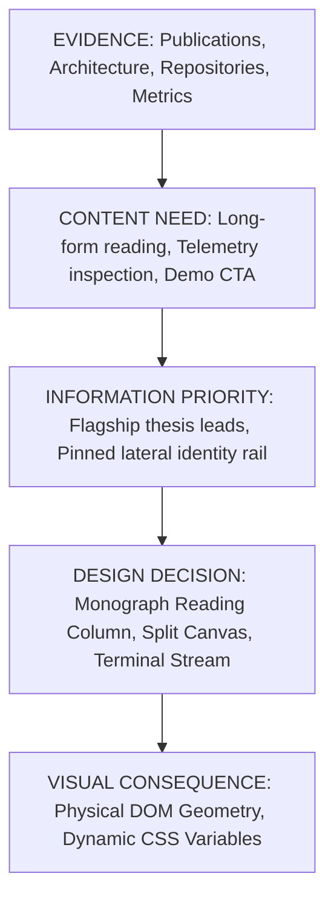

# 🏛️ Phase 43 — Design Causality Graph

## 1. Causal Pipeline Architecture

---

## 2. Formal Causal Pathways

1. **Research & Science Evidence**:
   - $\text{Publications} > 0 \implies \text{Art Direction: EDITORIAL\_RESEARCH}$
   - $\implies \text{Topology: narrow-reading-column}$
   - $\implies \text{Hero: monograph-thesis}$
   - $\implies \text{Project Form: academic-research-paper}$
2. **Distributed Systems & Kernel Evidence**:
   - $\text{Architecture} + \text{Metrics} \implies \text{Art Direction: TECHNICAL\_OBSERVATORY}$
   - $\implies \text{Topology: asymmetric-split-canvas}$
   - $\implies \text{Navigation: command-prompt-nav / lateral-rail}$
   - $\implies \text{Project Form: technical-dossier}$
3. **Open-Source Infrastructure Evidence**:
   - $\text{Public Repos} \implies \text{Art Direction: OPEN\_SOURCE\_ARCHIVE}$
   - $\implies \text{Topology: vertical-identity-rail}$
   - $\implies \text{Navigation: numbered-archive-nav}$
4. **Interactive & Product Evidence**:
   - $\text{Live URLs} + \text{High Impact} \implies \text{Art Direction: PRODUCT\_STUDIO}$
   - $\implies \text{Topology: edge-to-edge-editorial}$
   - $\implies \text{Hero: project-first}$
   - $\implies \text{Project Form: case-study-narrative}$
