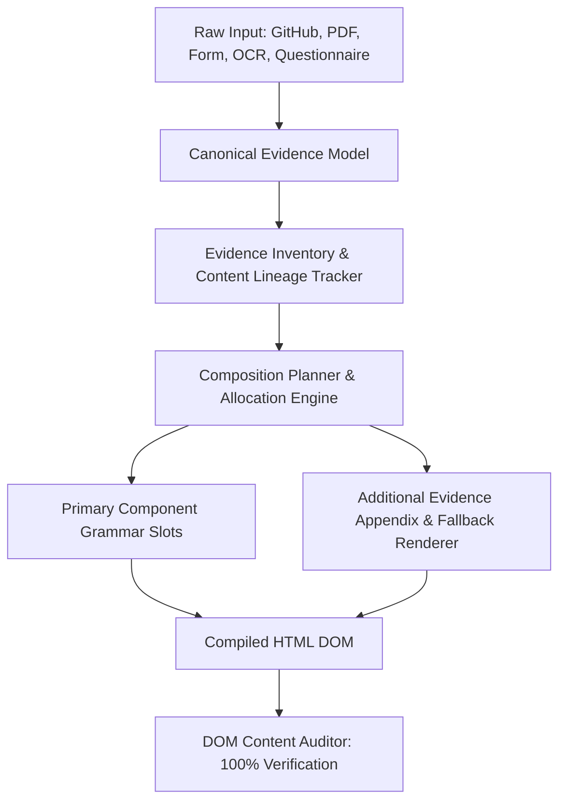

# 🏛️ Phase 45 Universal Content Preservation Architecture

## 1. The Sacred Information Invariant
> **"USER INFORMATION IS SACRED. The generator may reorganize, group, prioritize, and adapt presentation formats, but may NEVER drop, overwrite, flatten, or fabricate user information."**

Phase 45 establishes absolute data fidelity across the end-to-end portfolio synthesis pipeline. While previous phases established visual diversity and causality, Phase 45 guarantees that no visual aesthetic or layout constraint can ever justify the omission of user-supplied evidence.

---

## 2. Three-Stage Lossless Preservation Pipeline

1. **Stage 1 (Raw Input $\to$ Canonical Evidence)**: Every field, object, URL, metric, and custom attribute is ingested into `CanonicalEvidenceModel` without destructive projection.
2. **Stage 2 (Canonical Evidence $\to$ Composition Plan)**: The `CompositionPlan` establishes rendering commitments for all canonical facts across primary components or supplementary appendices.
3. **Stage 3 (Composition Plan $\to$ Rendered DOM)**: `HtmlRenderer` and `AdditionalEvidenceSection` execute the plan, ensuring 100% physical presence in the final document.

---

## 3. Preservation Modes
- **`PRIMARY`**: Displayed prominently in hero, featured project case study, or primary timeline.
- **`CONTEXTUAL`**: Integrated into lateral rails, technical specification blocks, or tag clouds.
- **`COLLAPSIBLE`**: Structured within progressive disclosure accordions or details views.
- **`APPENDIX`**: Rendered in structured technical appendices for deep specifications and custom fields.
- **`DROPPED` (FATAL)**: Prohibited in Phase 45. Any dropped field immediately fails the quality gate.
