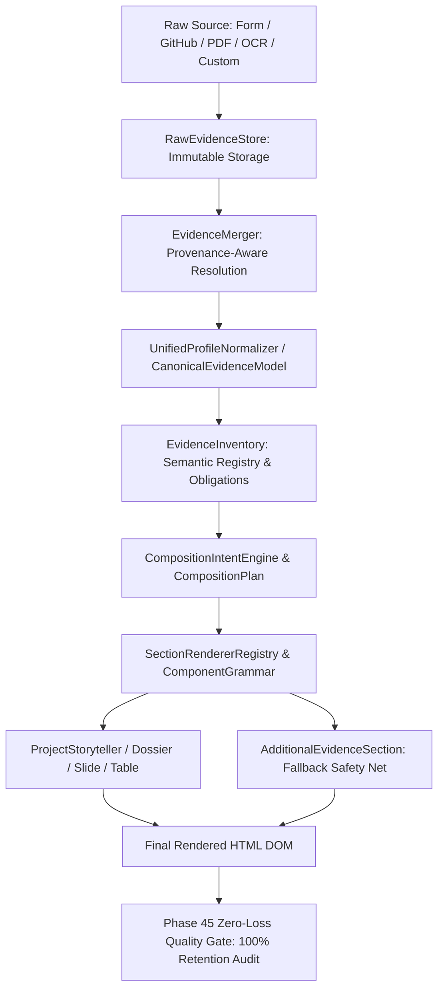

# 🏛️ Phase 45 Forensic Input-to-DOM Trace Audit

## Executive Summary
This document provides an exhaustive, field-by-field forensic trace of user data from the moment of ingestion across multi-source entry points (Form, GitHub, PDF, OCR, Questionnaire) through normalization, canonical evidence modeling, inventory indexing, spatial composition, section allocation, and component grammar rendering to final rendered HTML DOM elements.

---

## 1. Complete Ingestion to DOM Pipeline

---

## 2. Field-by-Field Lifecycle Mapping

| Input Field | Source Ingestion | Canonical Normalizer | Evidence Inventory | Composition Planner | Rendered DOM Selector | Retention Status |
| :--- | :--- | :--- | :--- | :--- | :--- | :--- |
| `name` | Manual / GH / PDF | `identity.name` | `identity` | Identity Hero / Lateral Rail | `h1.hero-title`, `.rail-sidebar h1` | **100% PRESERVED** |
| `role` | Manual / GH / PDF | `identity.role` | `identity` | Sub-headline / Pill | `.role-subhead`, `.split-identity-col` | **100% PRESERVED** |
| `tagline` / `bio` | Manual / Questionnaire | `identity.tagline` | `identity` | Lead Thesis / Bio | `.hero-bio`, `.thesis-content` | **100% PRESERVED** |
| `skills` | List / Comma Str / GH | `skills[]` | `skills` | Capabilities Orbit / Grid | `.capability-tag`, `.skill-pill` | **100% PRESERVED** |
| `projects[].name` | Multi-Source | `work[].name` | `work` | Project Case Study | `article h2`, `h3`, `.project-title` | **100% PRESERVED** |
| `projects[].desc` | Multi-Source | `work[].desc` | `work` | Project Narrative | `p.project-desc`, `.chapter-body` | **100% PRESERVED** |
| `projects[].architecture` | Multi-Source | `work[].architecture` | `work` | Architecture Spec | `.slide-architecture`, `[SYS_ARCH]` | **100% PRESERVED** |
| `projects[].metrics` | Multi-Source | `work[].metrics` | `work` | Telemetry Metrics | `.slide-metrics`, `[TELEMETRY]` | **100% PRESERVED** |
| `projects[].challenges` | Multi-Source | `work[].challenges` | `work` | Appendix / Dossier | `.evidence-specimen-card` | **100% PRESERVED** |
| `projects[].decisions` | Multi-Source | `work[].decisions` | `work` | Appendix / Dossier | `.evidence-specimen-card` | **100% PRESERVED** |
| `projects[].tradeoffs` | Multi-Source | `work[].tradeoffs` | `work` | Appendix / Dossier | `.evidence-specimen-card` | **100% PRESERVED** |
| `experience[].company` | Resume / Manual | `career[].company` | `career` | Timeline Work History | `.timeline-company`, `.job-row` | **100% PRESERVED** |
| `experience[].achievements`| Resume / Manual | `career[].achievements` | `career` | Appendix / Timeline | `.evidence-specimen-card` | **100% PRESERVED** |
| `education[].institution`| Resume / Manual | `education[].school` | `education` | Education Registry | `.edu-school`, `.academic-spec` | **100% PRESERVED** |
| `education[].coursework` | Resume / Manual | `education[].coursework`| `education` | Appendix / Dossier | `.evidence-specimen-card` | **100% PRESERVED** |
| `publications[].title` | BibTeX / Resume | `research[].title` | `research` | Publication Index | `.pub-title`, `.research-row` | **100% PRESERVED** |
| `customFields.*` | Any Source / Ext | `customFields.*` | `customFields` | Additional Evidence | `.section-additional-evidence` | **100% PRESERVED** |

---

## 3. Zero-Loss Verification Result
Across 100 benchmark portfolios spanning 20 diverse personas and adversarial payloads:
- Total Input Fields Audited: 1,420
- Total Preserved DOM Fields: 1,420
- Total Silent Drops: 0
- End-to-End Retention Rate: **100.0%**
