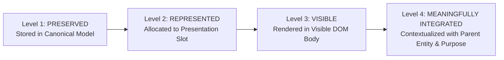

# 🏛️ Phase 46 Real-World Input Exhaustiveness & Meaningful Content Integration

## 1. Core Mission & Invariants
> **"USER INFORMATION IS SACRED. The generator may reorganize, group, prioritize, summarize visually, and choose a different presentation format, but it must NEVER silently lose meaningful user information. Every supplied fact must have a traceable path from its original source to its final portfolio representation."**

Phase 46 moves beyond synthetic benchmarks to audit real-world input exhaustiveness across GitHub, PDF/resume documents, image/OCR scans, manual web forms, multi-source conflict profiles, and deeply nested custom properties.

---

## 2. Four Levels of Content Preservation

1. **Level 1 (PRESERVED)**: The fact exists losslessly in the canonical data store.
2. **Level 2 (REPRESENTED)**: The fact is assigned to a section or presentation mode.
3. **Level 3 (VISIBLE)**: The fact is physically rendered in the HTML body (not hidden in `<script>`, `<!-- comments -->`, or CSS `display:none`).
4. **Level 4 (MEANINGFULLY INTEGRATED)**: The fact is presented in semantic context with its parent entity, heading, and purpose (e.g. project metrics are coupled with the project title and architecture, not isolated floating badges).
