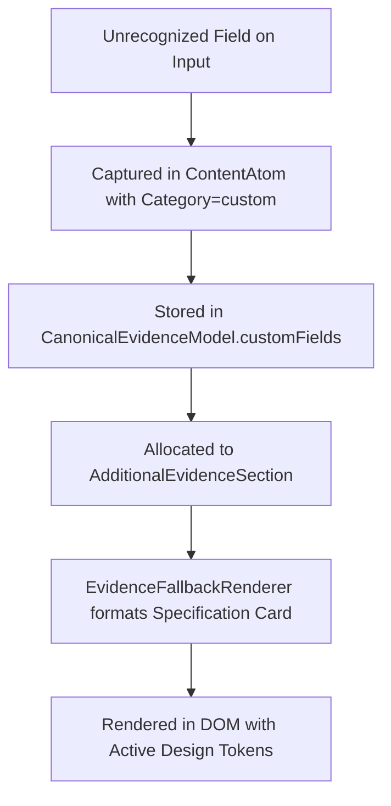

# 🏛️ Phase 46 Unknown & Custom Field Architecture

## 1. Dynamic Forward-Compatibility Policy
The generator guarantees that unmodeled, custom, or future schema additions are never silently deleted.

---

## 2. Dynamic Evidence Flow

Examples successfully preserved in benchmark:
- `patentsGranted`
- `openSourceGovernance`
- `orbitalMechanicsCertification`
- `radiationHardenedHardware`
- `formalVerificationProofs`
- `hardwareTestbedFacilities`
